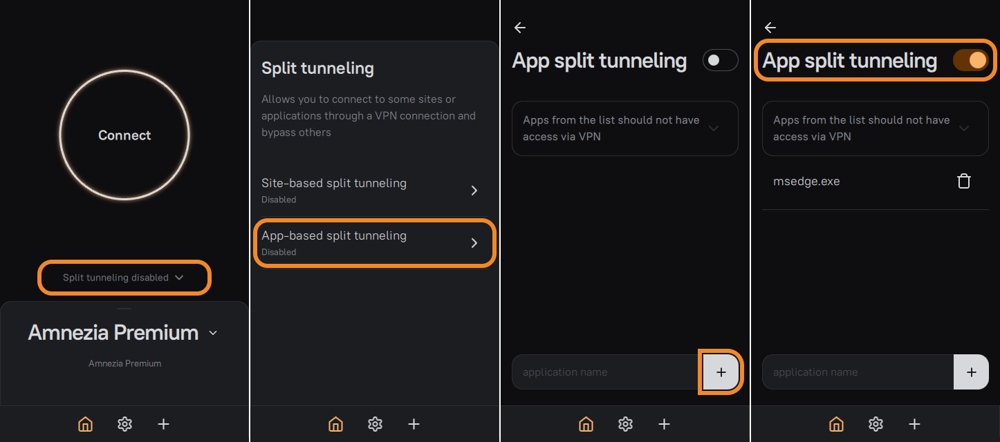

<!-- markdownlint-disable MD033 -->

# NutBlast

[header]: NutBlast.h
[example]: NutBlast-test.c


NutBlast is a library that enables **peer-to-peer multiplayer** in games using **WebSockets/WebRTC**. The client is written in C++, has C bindings, and works on Windows, Linux, _and_ **Emscripten**!

Based on [libdatachannel](https://github.com/paullouisageneau/libdatachannel). Comes with a public server-instance for out-of-the-box integration.

:heavy_check_mark: [Schwungus](https://github.com/Schwungus)-certified.

The spiritual successor of the desktop-only [NutPunch](https://github.com/Schwungus/NutPunch).

## Troubleshooting

> [!NOTE]
> Due to heavy resource usage and operating costs, the public NutBlaster instance does not provide [TURN](https://en.wikipedia.org/wiki/Traversal_Using_Relays_around_NAT).

If you're having **connectivity issues in a game powered by NutBlast**, please make sure (1) you aren't mangling your traffic (**disable [zapret](https://github.com/bol-van/zapret)**) and (2) **there is a direct route to your computer** from the public network. Using a proxy service for accessing the Web shouldn't interfere as long as **you aren't routing your game through it**.

You can **set up your VPN client to ignore NutBlast-powered games** rather than route them through the target proxy server. For example, in [AmneziaVPN](https://amnezia.org), use the split tunneling feature to **exclude the game's binary from VPN routing**. Just follow this infographic from [**their split-tunneling docs**](https://docs.amnezia.org/documentation/instructions/vpn-split-tunneling#split-tunneling-by-apps-on-windows):



This advice isn't guaranteed to fix your connectivity, but it's a good starting point for figuring out what exactly is wrong with your setup.

## Introductory Lecture

This library implements peer-to-peer networking, where **players directly communicate to each other** instead of completely relying on a server. It's a complex model, and it could be counterproductive to use if you don't know what you're doing.

The current server implementation uses a lobby-based approach, where each lobby supports up to 16 peers and is identified by a unique 8-character string. [The complete example][example] might be overwhelming at first, but make sure to skim through it before you do any heavy networking. Here's the general usage guide for NutBlast:

1. At the start of the program, set your game ID using `NutBlast_SetGameID()`. It is optional, but highly recommended, as it allows distinguishing your game's lobbies from others. A common example of a game ID would be `"GameName v1.0.0"`. Game IDs cannot be longer than 16 characters.
2. Host a lobby with `NutBlast_Host()`, or join an existing one with `NutBlast_Join()`. You cannot have two different lobbies with identical IDs; the lobby's ID identifies it uniquely per game ID.
3. You can optionally set callback functions using `NutBlast_OnConnected()`, `NutBlast_OnDisconnected()`, `NutBlast_OnPlayerJoined()`, `NutBlast_OnPlayerLeft()` and `NutBlast_OnLobbiesFound()` to implement custom behavior.
4. Call `NutBlast_Update()` each frame. This will also automatically connect to other players using trickle ICE.
5. Run the game logic.
6. Keep in sync with other players:
    1. Send messages with `NutBlast_SendTo()` or `NutBlast_SendReliablyTo()` (for reliable delivery).
    2. Retrieve incoming messages with `NutBlast_NextMessage()`.
    3. Set/retrieve lobby or player metadata with `NutBlast_Set*Field()`/`NutBlast_Get*Field()`.
7. Repeat steps 4 through 6 throughout the networking session.
8. Use `NutBlast_Disconnect()` to leave the lobby, or `NutBlast_Cleanup()` at the end of your program to perform final cleanup. (The latter disconnects you from the lobby as well.) You're all set!

An important aspect of NutBlast's networking is the ability to set lobby/player metadata in a simplified key-value-store fashion. Player metadata can include e.g. the player's username, their character - anything in a null-terminated string, mapped to another null-terminated string key. The same applies to lobby metadata: this could be the name of the level to play on, the difficulty level, rules to alter the game's behavior, etc.

For the lobby and each player, the current limit to how many fields they can hold is 8.

Call `NutBlast_Set*Field(...)`/`NutBlast_Get*Field(...)` to set/get key-value pairs; replace the asterisk with either `Peer` or `Lobby`. Setting metadata only does anything if you're "in charge" of the metadata object: either you're the lobby's master and want to set the lobby's metadata, or you're trying to set your own metadata as a player.

## Installation

If you're using CMake, you can include this library in your project by adding the following to your `CMakeLists.txt`:

```cmake
include(FetchContent)

FetchContent_Declare(NutBlast
    GIT_REPOSITORY https://github.com/Schwungus/NutBlast.git
    GIT_TAG master) # you can use a specific commit hash here
FetchContent_MakeAvailable(NutBlast)

add_executable(MyGame main.c) # your game's CMake target goes here
target_link_libraries(MyGame PRIVATE NutBlast)
```

## Basic Usage

Simply `#include` the library's [main header, `NutBlast.h`][header], in your program:

```c
#include <stdlib.h> // for EXIT_SUCCESS

#include <NutBlast.h>

int main(int argc, char* argv[]) {
    (void)argc, (void)argv;

    NutBlast_SetGameID("My Cool Game");

    if (/* hosting */)
        NutBlast_Host(1337, "My Lobby", 8, true);
    else
        NutBlast_Join(1337);

    for (;;) { // your game's main loop goes here...
        NutBlast_Update();
        NutBlast_SleepMS(1000 / 60);
    }

    NutBlast_Cleanup();
    return EXIT_SUCCESS;
}
```

If you ever get stuck, make sure to [RTFM](#introductory-lecture), and take another look at the [example code][example]. Don't forget to skim through [the main header][header] to find cool functions to use.

## Random Notes

1. You can connect to a locally running instance of the NutBlaster by setting the NutBlaster address to [ws://localhost:36900](ws://localhost:36900). You can also set the `NUTBLAST_DEV_LOCALHOST` CMake variable to `ON` in your `CMakeCache.txt`; after rebuild, it'll replace the default NutBlaster address with the localhost one.
2. TODO: document NutBlaster self-hosting & usage.
